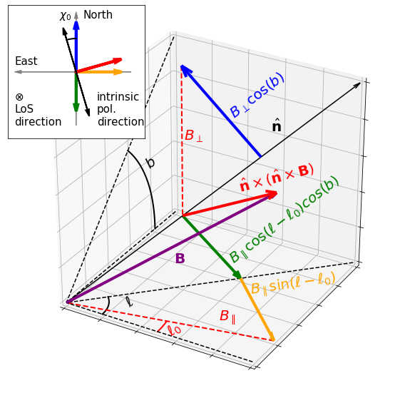

## hammurabi X Integrator class

The ``Integrator`` class is designed for calculating observables according to given physical fields.
In general, it deals with:

1. output observable form, size, shape, resolution, etc.
2. simulation resolution, type, settings, etc.
3. LoS integral method, and other auxiliary methods

- [header file](https://github.com/hammurabi-dev/hammurabiX/tree/master/include/integrator.h)
- [source file](https://github.com/hammurabi-dev/hammurabiX/tree/master/source/integrator/integrator.cc)

## function list:

- **``Integrator::Integrator``**
```
# input arguments
-
# return
-
```
> It is a default constructor.
Copy and move assignment/semantics are disabled explicitly.

- **`Integrator::write_grid`**
```
# input arguments
const Breg * (regular magnetic field) 
const Brnd * (random magnetic field)
const TEreg * (regular thermal electron field)
const TErnd * (random thermal electron field)
const CREfield * (cosmic-ray electron field)
const Grid_breg * (regular magnetic field grid)
const Grid_brnd * (random magnetic field grid)
const Grid_tereg * (regular thermal electron field grid)
const Grid_ternd * (random thermal electron field grid)
const Grid_cre * (cosmic-ray electron field grid)
Grid_obs * (observable grid)
const Param * (parameter-set)
# return
-
```
> It writes output maps into the disk with given file names.
The basic algorithm implemented in the `write_grid` function is to carry out the top-level LoS integral
of emission, absorption and Faraday rotation.
The top-level LoS integral is in fact accumulating the shells arranged from the observer to the given radial depth (or distance).
The shell means a geometric structure with minimum and maximum radial distance and fixed spherical resolution (or namely the number of pixels).
The shell concept is brought in for the convenience of manipulating simulation resolution at given position.
The bottom-level LoS integral is in charge of calculating observables within each shell, and this is defined in `radial_integrartion`.

> `write_grid` function makes use of the observable structure `struct_observables` and the shell information
structure `struct_shell`.
The `struct_observables` structure hosts `double` variables for registering observables at a given spherical direction and radial position.
The `structure_shell` structure hosts quantities for describing a single shell's thickness, radial and spherical resolution, etc..

- **`Integrator::los_versor`**
```
# input arguments
const double & (LoS polar angle in radian)
const double & (LoS azimuthal angle in radian)
# return
hamvec<3,double> (LoS pointing unit vector)
```
> It is an auxiliary function which re-expresses a line-of-sight (LoS) direction by a unit vector,
where the LoS direction is characterized by the polar and azimuthal angles.

- **`Integrator::los_perproj`**
```
# input arguments
const hamvec<3, double> & (Cartesian vector to be projected)
const double & (LoS polar angle in radian)
const double & (LoS azimuthal angle in radian)
# return
double (perpendicular projection)
```
> It calculates the magnitude of the outer product of a given vector and a LoS direction, as described by its name: the LoS perpendicular projection.

- **`Integrator::los_parproj`**
```
# input arguments
const hamvec<3, double> & (Cartesian vector to be projected)
const double & (LoS polar angle in radian)
const double & (LoS azimuthal angle in radian)
# return
double (parallel projection)
```
> It calculates the inner product of a given vector and a LoS direction, as described by its name: the LoS parallel projection.

- **`Integrator::sync_ipa`**
```
# input arguments
const hamvec<3, double> & (magnetic field vector)
const double & (LoS polar angle in radian)
const double & (LoS azimuthal angle in radian)
# return
double (intrinsic synchrotron polarization angle in IAU convention)
```
> It calculates the intrinsic polarization angle of the galactic synchrotron emission, by knowing the magnetic field and the LoS direction.

- **`Integrator::sync_emissivity_t`**
```
# input arguments
const hamvec<3, double> & (Galactic centric Cartisian position)
const Param * (parameter-set)
const CREfield * (cosmic-ray electron field)
const Grid_cre * (cosmic-ray electron field grid)
const double & (perpendicular component of the magnetic field w.r.t. the LoS direction)
# return
double (synchrotron total emissivity)
```
> It calculates the galactic synchrotron total emissivity at a given position, with sufficient knowledge of cosmic-ray electron and magnetic field distribution.

- **`Integrator::sync_emissivity_p`**
```
# input arguments
const hamvec<3, double> & (Galactic centric Cartisian position)
const Param * (parameter-set)
const CREfield * (cosmic-ray electron field)
const Grid_cre * (cosmic-ray electron field grid)
const double & (perpendicular component of the magnetic field w.r.t. the LoS direction)
# return
double (synchrotron polarized emissivity)
```
> It calculates the galactic synchrotron polarized emissivity at a given position, with sufficient knowledge of cosmic-ray electron and magnetic field distribution.

- **`Integrator::temp_convert`**
```
# input arguments
const double & (brightness temperature)
const double & (observational frequency in GHz)
# return
double (CMB temperature w.r.t. the 2.725K average)
```
> It converts brightness temperature from galactic emission into the CMB temperature (fluctuation on top of the 2.725K avegage).

- **`Integrator::radial_integration`**
```
# input arguments
const struct_shell * (temporary shell structure)
const pointing & (HEALPix pointing)
struct_observables * (temporary observable structure)
const Breg * (regular magnetic field) 
const Brnd * (random magnetic field)
const TEreg * (regular thermal electron field)
const TErnd * (random thermal electron field)
const CREfield * (cosmic-ray electron field)
const Grid_breg * (regular magnetic field grid)
const Grid_brnd * (random magnetic field grid)
const Grid_tereg * (regular thermal electron field grid)
const Grid_ternd * (random thermal electron field grid)
const Grid_cre * (cosmic-ray electron field grid)
const Param * (parameter-set)
# return
-
```
> For a given shell (with known minimal and maximal radial limit with respect to the observer) and LoS position (associated to the corresponding spherical pixel once the spherical resolution of the given shell is known), an observable should be calculated according to the related physical fields which reside within the space.
Such an calculation is implemented by the `radial_integration` function, and its radial integration method is discussed in the method list.

- **`Integrator::check_simulator_upper_limit`**
```
# input arguments
const double & (value to be tested)
const double & (upper limit)
# return
bool (checking result)
```
> It is an auxiliary function designed for checking whether an upper limit of a given integration setting parameter/variable is reached or not.

- **`Integrator::check_simulator_lower_limit`**
```
# input arguments
const double & (value to be tested)
const double & (lower limit)
# return
bool (checking result)
```
> It is an auxiliary function designed for checking whether a lower limit of a given integration setting parameter/variable is reached or not.

- **`assemble_shell_ref`**
```
# input arguments
struct_shell * (shell structure)
const Param * (parameter-set)
const std::size_t & (target shell index)
# return
-
```
> It is an auxiliary function designed for calculating radial sampling position according to given radial resolution and range.


## method list:

- **shell accumulation**

> The shell accumulation is implemented insided the ``write_grid`` function.
Here we outline the algorithm:

> 1. initialize output observable HEALPix maps with pre-defined output resolution
2. begin iteration over the number of shells
3. (inside shell iteration) initialize temporary observable maps with pre-defined simulation resolution
4. (insided shell iteration) initialize LoS sampling information for the current shell by the ``assemble_shell_ref`` function
5. (inside shell iteration) begin iteration over the number of pixels
6. (inside pixel iteration) call ``radial_integration`` function (finish pixel iteration)
7. (inside shell itration) interpolate temporary observable into output observable (finish shell iteration)

- **radial integral**

> The radial integral is implemented inside the ``radial_integration`` function.
Here we outline the algorithm:

> 1. initialize observables, all to zero. However, the Faraday depth and optical depth register the value accumulated from inner shells
2. calculate the wavelength and the coefficient required for converting birghtness temperature into CMB temperature
3. begin iteration over the radial distance
4. (inside radial iteration) calculate the observable-centric and galactic-centric Cartesian coordinate position
5. (inside radial iteration) retrieve the regular and random fields at the given position
6. (inside radial iteration) calculate observables at the current radial bin, and accumullate them to the observables (finish radial itertion)

- **synchrotron intrinsic polarization angle**

> The polarization angle is defined according to the `North-to-East` rule, i.e., the IAU convention.
Independent from the definition of the direction of polarization angle, the intrinsic polarization of synchrotron emission is perpendicular to the local magnetic field (projected onto the LoS plane).
Here we illustrate the relation with the figure below:

> 

- **synchrotron emissivity**

> (you may want to read the following part by an external markdown viewer)

> Here we derive in detail about how hammurabiX calculates the synchrotron emissivity.

> First of all we have the basic formular of synchrotron emissivity: 
$$j(\nu)=\frac{1}{4\pi}\int 2\pi N(E)P(\omega)dE ~,$$ 
where 
$$P(\nu)=2\pi P(\omega) ~.$$
$$N(E)$$ is the differential cosmic-ray electron (CRE) density, it can be expressed by CRE flux as 
$$N(E)=\frac{4\pi}{\beta c}\Phi(E) ~.$$
We can shift the energy coordinate $$E$$ into the Lorentz factor coordinate $$\gamma$$ by knowing that $$E=\gamma m_ec^2$$, and so
$$N(\gamma)=\frac{4\pi m_ec}{\beta}\Phi(E) ~.$$

> We define two CRE input cases. In the first case, we take CRE flux $$\Phi(E)$$ from external prepared numerical distribution, which means that the CRE flux distribution has been recorded in a hyper-rectangular grid.
The shape and size of such a grid must have been known by the ``Grid::Grid_cre`` class, please check the corresponding documentation pages for more details.
In the second case, we take CRE differential density $$N(\gamma)$$ from analytical description. The key point of this analytic input is that at any given spatial position, the CRE density has a constant spectral index.

> Given $$\Phi(E)$$, we can calculate the basic formular by
$$j_\mathrm{tot}=\left[\frac{\sqrt{3}e^3B_\perp}{m_ec^3}\right]\sum_i\delta E_i F(x_i)\frac{\Phi(E_i)}{\beta_i} ~,$$
where suffix $$\mathrm{tot}$$ means the total emissivty. 
To calculate the polarized emissivity $$j_\mathrm{pol}$$ we use the 2nd synchrotron function $$G(x)$$.
The synchrotron functions $$F(x)$$ and $$G(x)$$ are defined by
$$P_\mathrm{tot}=\frac{\sqrt{3}e^3B_\perp}{2\pi m_ec^2}F(x) ~,$$ 
$$P_\mathrm{pol}=\frac{\sqrt{3}e^3B_\perp}{2\pi m_ec^2}G(x) ~,$$
$$F(x) = x\int^\infty_x K_{\frac{5}{3}}(\xi)d\xi ~,$$
$$G(x) = xK_{\frac{2}{3}}(x) ~,$$
with $$K_{\frac{5}{3}}(x)$$ and $$K_{\frac{2}{3}}(x)$$ known as two of the modified Bessel functions of the second kind.

> The properties of the synchrotron function integrals read
$$\int dx F(x) x^\mu = \frac{2^{\mu+1}}{\mu+2}\Gamma(\frac{\mu}{2}+\frac{7}{3})\Gamma(\frac{\mu}{2}+\frac{2}{3}) ~,$$
$$\int dx G(x) x^\mu = 2^{\mu}\Gamma(\frac{\mu}{2}+\frac{4}{3})\Gamma(\frac{\mu}{2}+\frac{2}{3}) ~,$$
which suggests that, if we have a constant CRE spectral index at any given position, the spectral integral can be evaluated analytically with the Gamma functions.
Based on this idea, we can take analytic $$N(\xi,\gamma)$$ CRE input by assuming
$$N(\xi,\gamma) = N_0\gamma^{\alpha(\xi)}S(\xi) ~,$$
where the $\alpha$ is a position dependent constant and $S(\xi)$ represents the spatial profile of CRE density.
Additionally we set $$S_\odot=1$$ which means the spatial profile normalization is taken with respect to the observer.
For the $$N_0$$ normalization, we start with CRE flux $$\Phi_0=\Phi_\odot(\gamma_0)$$ near the observer, so
$$N_0=\Phi_0\frac{4\pi m_ec}{\beta_0}\gamma_0^{-\alpha_\odot} ~.$$
Here we skip all the intermediate derivation steps and give the final expression of emissivity
$$j_\mathrm{tot}(\xi,\nu)=\frac{\sqrt{3}e^3B_\perp N_0}{4\pi m_ec^2(1-\alpha)}\Gamma(-\frac{\alpha}{4}+\frac{19}{12})\Gamma(-\frac{\alpha}{4}-\frac{1}{12})S(\xi)(\frac{2\pi\nu m_ec}{3eB_\perp})^{\frac{1+\alpha}{2}} ~,$$
$$j_\mathrm{pol}(\xi,\nu)=\frac{\sqrt{3}e^3B_\perp N_0}{16\pi m_ec^2}\Gamma(-\frac{\alpha}{4}+\frac{7}{12})\Gamma(-\frac{\alpha}{4}-\frac{1}{12})S(\xi)(\frac{2\pi\nu m_ec}{3eB_\perp})^{\frac{1+\alpha}{2}} ~.$$
